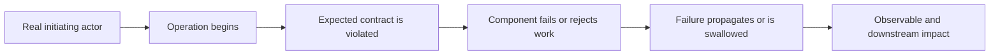

# Trace Failure

Explain the failure as a causal system, not as an isolated error string. Establish the real actor, execution context, failed boundary, and observable consequence before recommending changes.

Default to investigation. Do not edit code, configuration, infrastructure, data, or external systems unless the user explicitly asks for a fix. If asked to fix, complete the trace first and preserve it in the response.

## 1. Start with the actor

Begin every diagnosis with exactly this question:

> Who or what encounters this failure?

Answer it from supplied evidence when possible. Ask the user only when the answer cannot be discovered safely and would materially change the investigation.

Consider:

- product user
- founder or developer
- build or deployment system
- background job, scheduler, webhook, or queue worker
- API, database, container, network, or cloud service
- automated agent or tool runtime
- operator reading logs
- nobody directly because the failure is silent

Do not equate the location of an error message with the affected actor. A console error can be product-facing; a server log can come from a user request or background work; a CI failure usually affects customers only indirectly.

## 2. Classify the context

Choose one primary context before drawing the flow:

1. **Product-user error** - a customer action directly or indirectly fails.
2. **Developer workflow error** - compilation, dependency installation, local execution, or tooling fails.
3. **Build and release error** - CI, packaging, signing, deployment, migration, or publishing fails.
4. **Backend or infrastructure error** - an API, database, queue, container, network, or cloud service fails.
5. **Background automation error** - a scheduler, worker, webhook, retry, or agent fails without a direct user action.
6. **Silent behavioral failure** - behavior is visibly wrong but no error is shown.
7. **Unknown context** - evidence is insufficient to establish who encountered it.

Use secondary contexts when a failure crosses boundaries. Never fabricate a product-user journey to make the trace feel complete.

## 3. Reconstruct the causal chain

Trace evidence in this order:

1. initiating actor or trigger
2. component and operation entered
3. expected state or contract
4. actual state or response
5. exact failing boundary or assumption
6. propagation, retry, fallback, or swallowed rejection
7. immediate observable result
8. downstream user, release, data, cost, or operational impact

Begin the diagram with the real initiator: `Product user`, `Developer`, `CI pipeline`, `Scheduler`, `Webhook`, `API`, or `Agent`. Use a left-to-right Mermaid flowchart unless the path branches or loops. Keep nodes concrete and causal.

Separate confirmed facts, evidence-backed inferences, and unknowns. Cite files, symbols, logs, traces, tests, requests, or runtime observations when available. Do not claim deployed, production, GUI, device, or customer behavior from source inspection alone.

## 4. Find the meaningful cause

Distinguish the outer symptom from the inner failure. Examples include:

- `exit code 1` versus the signing exception that caused it
- `401 token expired` versus failed refresh or reauthentication
- `undefined.id` versus the missing upstream object or violated response contract
- `500` versus an external side effect that already committed
- a unique constraint violation versus harmless idempotency or a real ownership conflict

Trace backward until reaching the earliest unsupported assumption or broken contract for which evidence exists. Do not stop at merely restating the exception. Do not invent a root cause when only the failure point is known.

## 5. Inspect risk and recovery

Always check:

- whether work partially succeeded before the error
- whether retry is automatic, bounded, backed off, and idempotent
- whether retry can duplicate a charge, message, record, model request, or other side effect
- whether a batch, queue, release, or later user action is blocked
- whether the UI exposes, hides, or mishandles the rejection
- whether data is missing, stale, duplicated, leaked, or inconsistent
- whether logs and correlation identifiers can distinguish attempts
- what recovery or reconciliation path exists

Treat partial success across payment, email, data mutation, publishing, or other irreversible boundaries as high risk. Never recommend a blind retry. Inspect idempotency keys, provider state, webhook state, local persistence, and reconciliation first.

## 6. Select the right correction

Only after the trace is established, identify the smallest correction at the contract owner when the user asks for a fix or authorizes implementation. If the user asks only what an error means, why it happened, or explicitly says to explain before fixing, stop after the explanation, unknowns, and next evidence to inspect. Do not append unsolicited fix instructions.

When a correction is in scope, compare applicable options:

- validate or reject invalid input
- supply a semantically valid default
- correct an inaccurate type
- change the upstream contract or producer
- handle an expected rejection such as expiry or rate limiting
- repair authorization or ownership without broadening access
- add bounded retry, backoff, deduplication, idempotency, or reconciliation
- surface actionable UI feedback and clear loading state
- fix environment-specific paths, credentials, permissions, or packaging

Explain why the chosen layer owns the fix. Avoid non-null assertions, broad permission changes, swallowed errors, infinite retries, and generic catch-all fallbacks unless evidence shows they preserve the intended contract safely.

## 7. Return a decision-ready explanation

Use this order:

1. **Encountered by:** actor and whether a product user is directly involved.
2. **Context:** primary classification and any secondary context.
3. **Failure trace:** Mermaid diagram beginning with the real initiator.
4. **What is happening:** plain-language causal explanation.
5. **Impact:** immediate and downstream effects, separating confirmed from possible.
6. **Meaningful cause:** deepest evidence-supported broken assumption or contract; distinguish it from the outer error.
7. **Unknowns:** only facts that materially affect diagnosis or safety.
8. **Right fix:** include only when requested or implementation is explicitly authorized; state owner, safety concerns, and verification.

Keep the explanation proportional. A compiler error needs no fictional customer story; a payment partial-success incident needs explicit reconciliation and duplicate-side-effect analysis.

## Scenario guidance

Read [references/scenarios.md](references/scenarios.md) when the issue matches one of its canonical failure patterns or when a concrete diagram would improve the explanation. Load only the relevant scenario sections.
