# Canonical failure scenarios

Use these patterns as starting points, then replace generic nodes with evidence from the actual system. Do not copy a path whose actor or boundary is unproven.

## Contents

1. [Browser console error](#1-browser-console-error)
2. [Developer-only TypeScript error](#2-developer-only-typescript-error)
3. [Backend exception from logs](#3-backend-exception-from-logs)
4. [Database permission error](#4-database-permission-error)
5. [Background job failure](#5-background-job-failure)
6. [GitHub Actions or deployment failure](#6-github-actions-or-deployment-failure)
7. [Application startup crash](#7-application-startup-crash)
8. [Authentication failure](#8-authentication-failure)
9. [Third-party API failure](#9-third-party-api-failure)
10. [Silent broken behavior](#10-silent-broken-behavior)
11. [Agent or tool-call failure](#11-agent-or-tool-call-failure)
12. [Partial-success error](#12-partial-success-error)

## 1. Browser console error

Example: `Uncaught TypeError: Cannot read properties of undefined (reading 'id')` after Save.

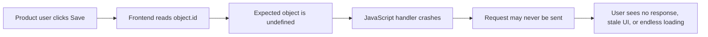

Classify this as product-facing when the failed handler interrupts the user's action even though the technical message appears only in DevTools. Verify whether the request was sent and which UI state was left behind.

## 2. Developer-only TypeScript error

Example: `TS2322: Type 'string | undefined' is not assignable to type 'string'`.

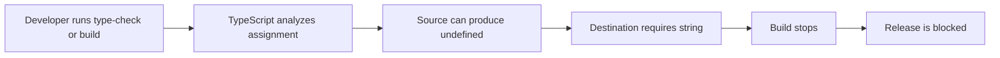

State that the end user does not encounter this compiler error. Trace why the value can be undefined, then choose among validation, a meaningful default, a corrected type, or an upstream contract change. Do not hide uncertainty with a non-null assertion.

## 3. Backend exception from logs

Example: `AttributeError: 'NoneType' object has no attribute 'email'`.

First determine whether the execution came from a direct API request, scheduled process, webhook, queue worker, or startup task. For a confirmed request path:

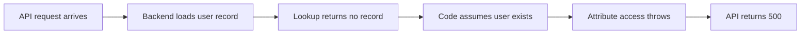

Determine separately whether a product user initiated the request. If the trigger is unknown, say so and do not invent it.

## 4. Database permission error

Example: `FirebaseError: Missing or insufficient permissions`, working for one account but not another.

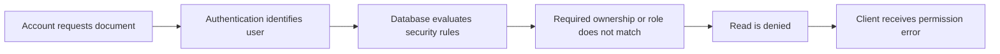

Inspect who is signed in, the exact document path, the applicable rule, and the required identity, role, claim, or ownership. Explain how the UI handles the rejection. Treat broadening a rule as a data-exposure risk and verify access for both the intended account and a forbidden account.

## 5. Background job failure

Example: `duplicate key value violates unique constraint` in scheduled-job logs.

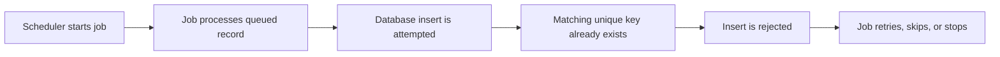

Do not invent an immediate user interaction. Determine whether the existing record is already correct, whether this is harmless idempotency or a real conflict, whether the batch stops, and whether retries repeat the failure. Trace later user impact such as missing, stale, or duplicated information.

## 6. GitHub Actions or deployment failure

Example: `Process completed with exit code 1` and signing failed with `0x80004005`.

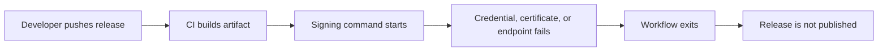

Treat the release pipeline as the direct actor. Customers normally remain on the previous version rather than encountering the pipeline error. Distinguish the generic outer exit code from the meaningful signing exception and verify publication independently from build completion.

## 7. Application startup crash

Example: `failed to initialize database: unable to open database file`.

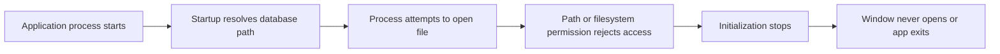

Establish whether this occurred in local development or an installed application. Compare development and production paths, working directories, sandboxing, parent-directory creation, ownership, and permissions instead of assuming the environments are equivalent.

## 8. Authentication failure

Example: `401 Unauthorized: token expired`.

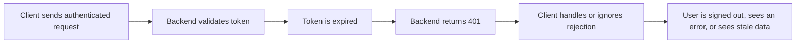

Token expiration is expected. Investigate refresh, refresh-token validity, clock skew, concurrent refresh, retry, reauthentication, and client state cleanup before naming expiration itself as the defect.

## 9. Third-party API failure

Example: `429 rate_limit_exceeded` from a model provider.

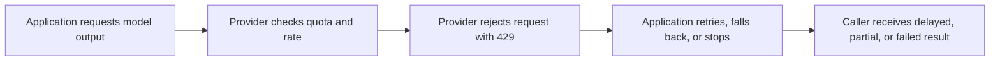

Distinguish per-minute request or token limits from account quota and billing limits. Inspect retry headers, exponential backoff with jitter, maximum attempts, concurrency, user-visible fallback, duplicate billing risk, and whether the work is interactive or background.

## 10. Silent broken behavior

Example: a button spins forever with no visible error.

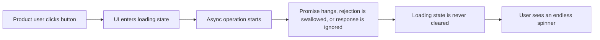

Activate the skill for symptoms, not only explicit error strings. Inspect network completion, timeouts, cancellation, swallowed exceptions, stale-response guards, state transitions, and cleanup in `finally` or equivalent paths.

## 11. Agent or tool-call failure

Example: `tool_not_allowed: send_email`.

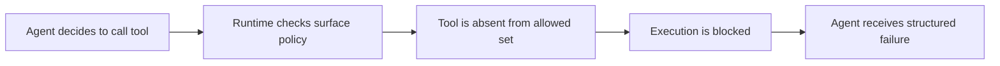

Identify the surface where the agent ran, the policy selected for that surface, and who received the structured result. Do not classify it automatically as product-facing or developer-only. Treat execution-time enforcement as the security boundary; prompt instructions alone do not prove a tool is blocked.

## 12. Partial-success error

Example: Stripe charged the customer but the local API returned `500`.

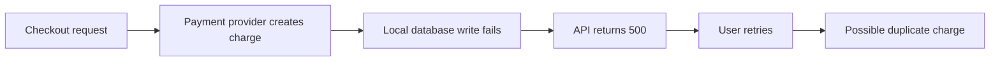

Treat this as high risk. Do not recommend a blind retry or assume the provider rolled back. Inspect the idempotency key, provider transaction state, webhook delivery, local operation record, retry behavior, and reconciliation path. Prefer recovery keyed to the already-completed external side effect and verify that a repeated client request cannot create another charge.
